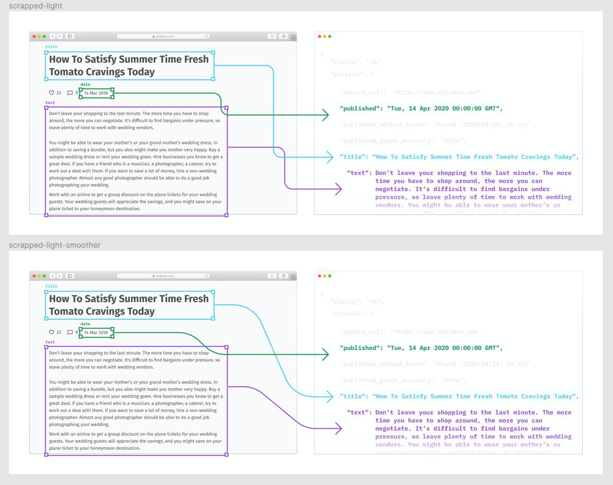

# extract-news-api
Flask code to deploy an API that pulls structured data from online news articles.

This is a source code of an API that you can find here (free plan available): https://rapidapi.com/kotartemiy/api/extract-news





## Quick Start
1. Clone the repository to your local folder 

`git clone https://github.com/kotartemiy/extract-news-api.git`

2. Create a Python virtual environment (3.6+)

`python -m venv env`

3. Activate the environment

`source env/bin/activate`

4. Run `pip install -r extract-news-ap/requirements.txt`
5. Run `python extract-news-ap/app.py` in your terminal 

If everything is OK then you should be able to check your API on `http://127.0.0.1:5000/v0/article`

Example of request: `http://127.0.0.1:5000/v0/article?url=https://www.nytimes.com/2020/03/21/arts/d-nice-instagram.html`

## Example of Response Body
``` javascript
{
    "status": "ok",
    "article": {
        "source_url": "https://www.nytimes.com",
        "published": "Sat, 21 Mar 2020 23:31:12 GMT",
        "published_method_found": "Extracted from tag:\n<time class=\"css-1sbuyqj e16638kd4\" datetime=\"2020-03-21T19:31:12-04:00\">March 21, 2020</time>",
        "published_guess_accuracy": "datetime",
        "title": "The Hottest Parties in Town Are Now Online",
        "text": "On Friday night there was one place in the country where you could take part in a social gathering and not be afraid of spreading or contracting the coronavirus.\n\nOver 4,000 people were in attendance, including headliners like Jennifer Lopez, Drake, Naomi Campbell, Diddy, Mary J. Blige, DJ Khaled, T.I., Queen Latifah and Tracee Ellis Ross.\n\nThere was no charge at the door, no security, no drink minimum and you could attend in your pajamas from the comfort of your own home.\n\nThe party, named Homeschoolin’, was easy to find: It was on D.J. D-Nice’s Instagram live.\n\nSince Wednesday, Derrick Jones, 49, more popularly known as D-Nice, has held streams of hourslong jam sessions from his home in Los Angeles. He plays all of the hits, new and old, but you never hear the same song twice.",
        "authors": [
            "Sandra E. Garcia"
        ],
        "images": [
            "https://static01.nyt.com/images/2020/03/21/us/21xp-virus-digitalparties-image/21xp-virus-digitalparties-image-articleLarge.jpg?quality=75&auto=webp&disable=upscale",
            "https://static01.nyt.com/images/2020/03/21/us/21xp-virus-digitalparties-image/21xp-virus-digitalparties-image-facebookJumbo.jpg"
        ],
        "top_image": "https://static01.nyt.com/images/2020/03/21/us/21xp-virus-digitalparties-image/21xp-virus-digitalparties-image-facebookJumbo.jpg",
        "meta_image": "https://static01.nyt.com/images/2020/03/21/us/21xp-virus-digitalparties-image/21xp-virus-digitalparties-image-facebookJumbo.jpg",
        "movies": [],
        "meta_keywords": [
            ""
        ],
        "tags": [],
        "meta_description": "As many are quarantining or socially distancing themselves to curb the spread of the coronavirus, the party has moved to social media.",
        "meta_lang": "en",
        "title_lang": "en",
        "text_lang": "en",
        "meta_favicon": "/vi-assets/static-assets/favicon-4bf96cb6a1093748bf5b3c429accb9b4.ico"
    }
}
```

## Good to use in combination with
[newscatcher](https://github.com/kotartemiy/newscatcher)

Newscatcher Python library allows you to collect normalized news from (almost) any website.

[Newscatcher API](https://newscatcherapi.com/)

Newscatcher API is a news API that allows you to find the most relevant news artiles by searching for any keywod. 


## Built with
[Flask](https://github.com/pallets/flask) Copyright 2010 Pallets

[newspaper](https://github.com/codelucas/newspaper) Copyright (c) 2013 Lucas Ou-Yang

[date_guesser](https://github.com/mitmedialab/date_guesser) Copyright (c) 2018 MIT Center for Civic Media

